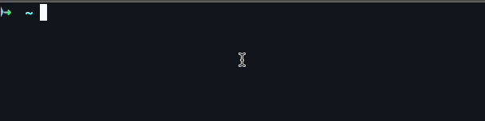

# macOS Voice Type

**Free, offline voice-to-text for macOS using Whisper AI.**

Press a hotkey anywhere, speak, and your words are typed automatically. No subscription, no cloud, no API keys - runs 100% locally on your Mac.



## Features

- **Works everywhere** - Chrome, Safari, Notes, VS Code, Slack, and any other app
- **Offline & private** - No data leaves your Mac
- **Accurate** - Uses Whisper small.en model for reliable transcription
- **Auto-stops on silence** - Just pause speaking
- **Visual indicator** - Floating pill shows recording/transcribing status
- **Free forever** - No subscriptions or API costs

## Install

```bash
git clone https://github.com/gabrielanhaia/macos-voice-type.git
cd macos-voice-type
./install.sh
```

## Setup (3 steps)

### Step 1: Grant Accessibility Permission

1. Open **System Settings** → **Privacy & Security** → **Accessibility**
2. Click **+** → select `/Applications/VoiceType.app`
3. Toggle **ON**

### Step 2: Create Keyboard Shortcut

1. Open **Shortcuts** app
2. Click **+** → name it "Voice Type"
3. Add **"Run Shell Script"** action
4. Enter: `$HOME/bin/voice-shortcut`
5. Click shortcut name → **Add Keyboard Shortcut** → press your keys (e.g. `Ctrl+Option+V`)


### Step 3: Test It

1. Open any app with a text field
2. Press your shortcut
3. Speak after the "pop" sound
4. Wait for the "glass" sound - done!

> **Note:** Restart apps like Chrome after setup for the shortcut to work.

### Optional: Start Indicator on Login

The visual indicator runs automatically after install. To start it on login:

1. Open **System Settings** → **General** → **Login Items**
2. Click **+** → select `/Applications/VoiceTypeIndicator.app`

## Terminal Commands (Optional)

```bash
voice-claude        # Send voice command to Claude Code
voice-claude-chat   # Interactive voice chat with Claude
```

## Troubleshooting

| Problem | Solution |
|---------|----------|
| No sound when pressing shortcut | Check Shortcuts app has the shortcut set |
| Works in some apps but not others | Restart the app |
| "Basso" error sound | Speak louder/clearer, check microphone |
| Text not typed | Check VoiceType.app has Accessibility permission |

## Uninstall

```bash
rm ~/bin/voice-type ~/bin/voice-shortcut ~/bin/voice-claude ~/bin/voice-claude-chat ~/bin/voicetype-notify
rm -rf /Applications/VoiceType.app /Applications/VoiceTypeIndicator.app
rm -rf ~/.local/share/whisper-cpp  # Optional: removes ~540MB of models
```

## Credits

[whisper.cpp](https://github.com/ggerganov/whisper.cpp) • [OpenAI Whisper](https://github.com/openai/whisper) • [SoX](https://sox.sourceforge.net/)

## License

MIT
